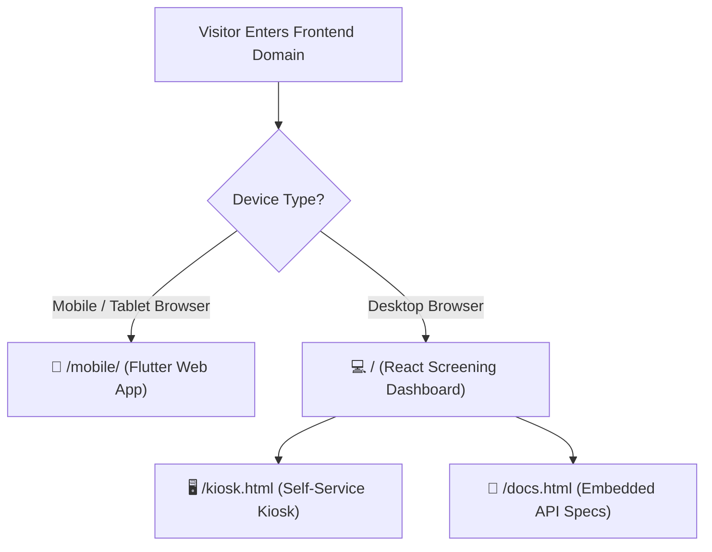

<p align="center">
	
</p>

<h1 align="center">ShieldID</h1>

<p align="center">
  <strong>AI-Powered Identity Verification, Tamper Detection & Fraud Screening Platform</strong>
</p>

<p align="center">
  Scan documents, validate biometric liveness, detect digital tampering, and automate real-time KYC risk decisions.
</p>

<p align="center">
  <a href="https://shieldid-api.onrender.com/health"></a>
  <a href="https://shieldid-api.onrender.com/api/docs"></a>
  <a href="https://github.com/Pikallery/ShieldID/actions"></a>
  <a href="https://flutter.dev"></a>
  <a href="LICENSE"></a>
</p>

---

## 🚀 Live Deployments & Quick Access

ShieldID is deployed across scalable cloud infrastructure. All services and client interfaces are accessible below:

| Surface / Service | Platform | Purpose | Live Link |
|---|---|---|---|
| **Backend REST API** |  | Production FastAPI async engine & PostgreSQL | [`shieldid-api.onrender.com`](https://shieldid-api.onrender.com/health) |
| **Interactive API Documentation** |  | Test live endpoints & verify schemas in browser | [`/api/docs`](https://shieldid-api.onrender.com/api/docs) |
| **Alternative API Reference** |  | Clean, production-ready technical specification | [`/api/redoc`](https://shieldid-api.onrender.com/api/redoc) |
| **Admin Screening Dashboard** |  | Desktop compliance dashboard, analytics & manual review | [Open Dashboard (`/`)](#-web--mobile-routing) |
| **Mobile Web Scanner** |  | Cross-platform document & biometric camera scanner | [Open Mobile App (`/mobile/`)](#-web--mobile-routing) |
| **Verification Kiosk Flow** |  | Self-service kiosk interface for reception devices | [Open Kiosk (`/kiosk.html`)](#-web--mobile-routing) |

---

## 📱 Web & Mobile Routing

The frontend features **intelligent client routing** from a single unified deployment:



- **Smart Device Detection**: Visiting the root URL on a smartphone automatically routes to the native **Flutter Mobile Experience** (`/mobile/`).
- **Desktop Override**: Append `?desktop=1` to force the Desktop Dashboard on any device.
- **Mobile Override**: Append `?mobile=1` to preview the Mobile Flutter UI on desktop.

---

## ⚡ Core Capabilities

- **Document Verification**: OCR extraction, document classification (Aadhaar, Passport, PAN, Driving Licence, Voter ID), MRZ parsing, and structured identity data.
- **Tamper Analysis**: Error Level Analysis (ELA), digital splice detection, text font inconsistencies, stamp copy-move, and edge geometry verification.
- **Face Verification & Liveness**: 1:1 facial embedding matching, 3D landmark analysis, blink detection, and anti-spoofing challenges.
- **Explainable Risk Engine**: Automated `PASS`, `REVIEW`, or `REJECT` recommendations with weighted risk scores and visual breakdown.
- **KYC Sessions**: QR token workflows, status polling, and encrypted audit trail logging.
- **Currency Authenticity**: Banknote security thread, watermark, and microprinting verification.
- **Fraud Reporting**: Instant FIR dispatch logging with geographical coordinates.

---

## 🏗️ System Architecture

```text
                                  +-----------------------------+
                                  |     ShieldID Backend API    |
                                  |    FastAPI + Uvicorn + DB   |
                                  +--------------+--------------+
                                                 |
                   +-----------------------------+-----------------------------+
                   |                             |                             |
      +------------v------------+   +------------v------------+   +------------v------------+
      |  React Admin Dashboard  |   |  Self-Service Kiosk UI  |   |  Flutter Mobile Web App |
      |     Desktop Surface     |   |      Counter Device     |   |     Camera & Capture    |
      +-------------------------+   +-------------------------+   +-------------------------+
                   |                             |                             |
                   +-----------------------------+-----------------------------+
                                                 |
                        +------------------------v------------------------+
                        |   Async AI Pipeline: OCR | Face | Tampering    |
                        |     PostgreSQL (Asyncpg) + Redis + Alembic      |
                        +-------------------------------------------------+
```

---

## 🛠️ Technology Stack

| Layer | Stack |
|---|---|
| **Backend API** | FastAPI, Uvicorn, Pydantic v2, Python 3.10+ |
| **Database & Cache** | PostgreSQL, SQLAlchemy 2.0 (Async), Asyncpg, Alembic, Redis |
| **Computer Vision & AI** | OpenCV, NumPy, Pillow, Scikit-Image, DeepFace |
| **Desktop Web & Kiosk** | React 18, Vite, Vanilla CSS, HTML5 Canvas |
| **Mobile Client** | Flutter 3.x, Dart, Material Design 3, Camera Plugin |
| **Hosting & CI/CD** | Render (Docker Web Service & Managed Postgres), Vercel (Frontend SPA & Flutter Web), GitHub Actions |

---

## 📂 Repository Layout

```text
ShieldID/
├── src/                         FastAPI backend application
│   ├── api/v1/                  API route handlers (verify, kyc, report, analytics)
│   ├── core/                    Config, database engines, security, logging
│   ├── models/                  SQLAlchemy ORM models
│   ├── processors/              AI modules (OCR, face matching, ELA tampering, currency)
│   ├── schemas/                 Pydantic request/response validation models
│   └── services/                Business logic and database orchestration
├── frontend/
│   ├── dashboard/               React dashboard, kiosk flow & Vercel deployment shell
│   │   ├── public/mobile/       Pre-compiled Flutter Web distribution
│   │   └── vercel.json          SPA & multi-surface routing configuration
│   └── mobile/                  Flutter mobile source code (Dart, widgets, themes)
├── tests/                       Full test suite (163 passing tests)
│   ├── integration/             API endpoints & database integration tests
│   └── unit/                    Processor, schema & config unit tests
├── Dockerfile                   Production Docker container definition
├── start.sh                     Container entrypoint for migrations & Uvicorn startup
└── requirements.txt             Backend Python dependencies
```

---

## 💻 Local Development Setup

### 1. Prerequisites
- Python 3.10+
- Node.js 18+
- Flutter SDK (optional, for mobile app development)
- Docker Desktop (optional, for local Postgres/Redis)

### 2. Backend Setup
```bash
# Clone the repository
git clone https://github.com/Pikallery/ShieldID.git
cd ShieldID

# Create and activate virtual environment
python -m venv venv
venv\Scripts\activate   # Windows
# source venv/bin/activate # macOS/Linux

# Install dependencies
pip install -r requirements.txt

# Start database services with Docker (or use external Postgres)
docker compose up -d db redis

# Run FastAPI dev server
uvicorn src.main:app --reload --port 8080
```
- API Health: [`http://localhost:8080/health`](http://localhost:8080/health)
- API Docs: [`http://localhost:8080/api/docs`](http://localhost:8080/api/docs)

### 3. Frontend Dashboard Setup
```bash
cd frontend/dashboard
npm install
npm run dev
```
Open `http://localhost:5173/` in your browser.

### 4. Flutter Mobile Setup
```bash
cd frontend/mobile
flutter pub get
flutter run -d chrome    # Run in browser
# flutter run            # Run on connected Android / iOS device
```

---

## 🧪 Testing & Verification

Run the full automated test suite:

```bash
# Run all 163 backend unit and integration tests
pytest

# Check code linting and formatting
ruff check src tests
ruff format --check src tests

# Test frontend dashboard production build
npm --prefix frontend/dashboard run build

# Run Flutter static analysis & tests
cd frontend/mobile && flutter analyze && flutter test
```

---

## 📄 License

This project is licensed under the [MIT License](LICENSE).