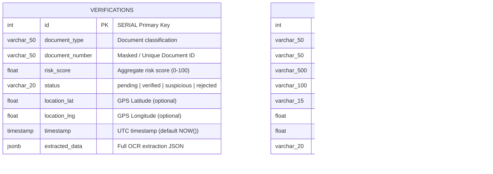

# 🗄️ ShieldID Database Schema Documentation

**Database Engine:** PostgreSQL 15+  
**ORM Framework:** SQLAlchemy 2.0 (AsyncIO with `asyncpg`)  
**Migration Tool:** Alembic  
**Caching & Session Store:** Redis 7  

---

## 1. Architectural Overview

The ShieldID persistence layer is built on **PostgreSQL 15** utilizing native `JSONB` support for schema-flexible AI inference payloads (OCR extraction data and tampering analysis results). Asynchronous I/O is managed via `asyncpg` combined with SQLAlchemy 2.0 `Mapped` and `mapped_column` declarative models.

Alembic provides reproducible, version-controlled database schema migrations. A container initialization script (`deployment/scripts/init-db.sql`) guarantees idempotent bootstrapping on fresh environments with extensions enabled (`uuid-ossp`, `pgcrypto`).

---

## 2. Entity Relationship Diagram (ERD)



---

## 3. Table Specifications

### 3.1 `verifications` Table
Stores each document verification request, computed risk scores, OCR payload, and forensic tampering diagnostics.

| Column | Type | Nullable | Default | Constraints / Description |
| :--- | :--- | :--- | :--- | :--- |
| `id` | `INTEGER` | **No** | Auto-increment (`SERIAL`) | Primary Key. |
| `document_type` | `VARCHAR(50)` | **No** | - | Type of document: `passport`, `aadhaar`, `pan`, `driving_license`, `voter_id`. |
| `document_number` | `VARCHAR(50)` | **No** | - | Masked or raw document identifier (e.g., `Z1234567`, `XXXX XXXX 9012`). |
| `risk_score` | `FLOAT` | **No** | - | Calculated risk metric ranging from `0.0` (safe) to `100.0` (fraudulent). |
| `status` | `VARCHAR(20)` | **No** | `'pending'` | Lifecycle state: `pending`, `verified`, `suspicious`, `rejected`. |
| `location_lat` | `FLOAT` | Yes | `NULL` | WGS84 latitude of client or verification terminal. |
| `location_lng` | `FLOAT` | Yes | `NULL` | WGS84 longitude of client or verification terminal. |
| `timestamp` | `TIMESTAMP` | Yes | `NOW()` | UTC record creation timestamp. |
| `extracted_data` | `JSONB` | **No** | - | Structured document data extracted by OCR engine. |
| `tamper_result` | `JSONB` | Yes | `NULL` | Forensic tampering detection metrics and regions. |

#### `verifications` Performance Indexes
```sql
CREATE INDEX idx_verifications_status ON verifications(status);
CREATE INDEX idx_verifications_risk ON verifications(risk_score);
CREATE INDEX idx_verifications_timestamp ON verifications(timestamp);
CREATE INDEX idx_verifications_doc_number ON verifications(document_number);
```

#### JSONB Payload Schema: `extracted_data`
```json
{
  "document_type": "passport",
  "confidence_score": 0.95,
  "raw_text": "PASSPORT REPUBLIC OF INDIA RAHUL SHARMA Z1234567...",
  "parsed_fields": {
    "name": "Rahul Sharma",
    "passport_number": "Z1234567",
    "nationality": "Indian",
    "date_of_birth": "1990-01-15",
    "date_of_expiry": "2030-01-14",
    "gender": "M"
  }
}
```

#### JSONB Payload Schema: `tamper_result`
```json
{
  "is_tampered": false,
  "tamper_score": 0.08,
  "tampering_regions": [],
  "detection_method": "Error Level Analysis + CNN Forensic"
}
```

---

### 3.2 `reports` Table
Stores reported fraudulent document submissions, law enforcement incident tracking, and First Information Report (FIR) numbers.

| Column | Type | Nullable | Default | Constraints / Description |
| :--- | :--- | :--- | :--- | :--- |
| `id` | `INTEGER` | **No** | Auto-increment (`SERIAL`) | Primary Key. |
| `fir_number` | `VARCHAR(50)` | **No** | - | Unique system-generated FIR identifier (e.g., `FIR-2026-AB12CD`). |
| `document_type` | `VARCHAR(50)` | **No** | - | Type of fraudulent document reported. |
| `description` | `VARCHAR(500)` | **No** | - | Narrative explanation of forgery or observed irregularity. |
| `reporter_name` | `VARCHAR(100)` | Yes | `NULL` | Name of reporting officer, citizen, or KYC agent. |
| `reporter_phone` | `VARCHAR(15)` | Yes | `NULL` | Contact telephone number for follow-up investigation. |
| `location_lat` | `FLOAT` | Yes | `NULL` | Incident latitude coordinate. |
| `location_lng` | `FLOAT` | Yes | `NULL` | Incident longitude coordinate. |
| `status` | `VARCHAR(20)` | Yes | `'pending'` | Case workflow: `pending`, `investigating`, `action_taken`, `closed`. |
| `timestamp` | `TIMESTAMP` | Yes | `NOW()` | UTC timestamp when report was filed. |

#### `reports` Performance Indexes
```sql
CREATE UNIQUE INDEX idx_reports_fir ON reports(fir_number);
CREATE INDEX idx_reports_status ON reports(status);
CREATE INDEX idx_reports_timestamp ON reports(timestamp);
```

---

## 4. Alembic Migration Strategy

Database migrations are tracked in `migrations/` and orchestrated using Alembic.

### 4.1 Migration File: `001_initial_schema.py`
- **Revision ID:** `001`
- **Revises:** `None`
- **Actions:**
  - Creates `verifications` and `reports` tables.
  - Provisions single and composite indexes (`idx_verifications_status`, `idx_reports_fir`, etc.).
  - Downgrade removes indexes in reverse topological sequence and drops tables cleanly.

### 4.2 Executing Migrations

#### Apply latest migrations (Production / Staging):
```bash
alembic upgrade head
```

#### Rollback one migration:
```bash
alembic downgrade -1
```

#### Generate a new autodetected migration after model updates:
```bash
alembic revision --autogenerate -m "add_column_name_to_verifications"
```

---

## 5. Security, Masking & DPDP Act 2023 Compliance

1. **Aadhaar Masking**: In accordance with UIDAI regulations and the Digital Personal Data Protection (DPDP) Act 2023, the first 8 digits of Aadhaar numbers MUST be masked before persistence into `document_number` or `extracted_data` (e.g., `XXXX XXXX 9012`).
2. **Encryption at Rest**: Production storage volumes must utilize AES-256 block-level encryption (AWS EBS / GCP Persistent Disk) and column-level encryption via PostgreSQL `pgcrypto` for sensitive PII.
3. **Audit Trails**: All modifications to verification and report records are timestamped with UTC server time.
